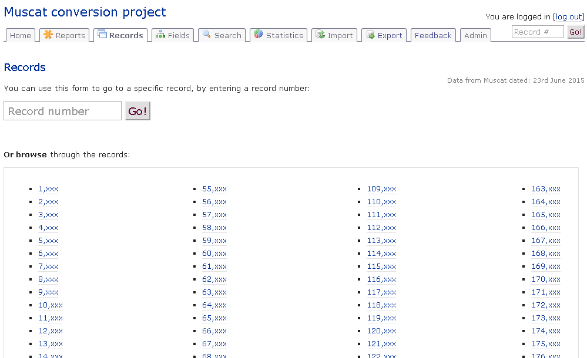

Muscat conversion system
========================

This is a PHP application to assist with the conversion from Muscat to MARC21.

A [talk about the project](https://www.youtube.com/watch?v=kVIvFswvRXI) was given to the [CILIP CIG (MDG) Conference 2020: Metadata and Discovery](https://www.cilip.org.uk/events/EventDetails.aspx?id=1332403) conference on 9th September 2020.

Screenshot
----------

Usage
-----

1. Clone the repository.
2. Download the library dependencies and ensure they are in your PHP include_path.
3. Download and install the famfamfam icon set in /images/icons/
4. Add the Apache directives in httpd.conf (and restart the webserver) as per the example given in .httpd.conf.extract.txt; the example assumes mod_macro but this can be easily removed.
5. Create a copy of the index.html.template file as index.html, and fill in the parameters.
6. Install the transliteration program as per the install script in the libraries/transliteration/ directory
7. Access the page in a browser at a URL which is served by the webserver.

Dependencies
------------

* [application.php application support library](http://download.geog.cam.ac.uk/projects/application/)
* [csv.php CSV manipulation library](http://download.geog.cam.ac.uk/projects/csv/)
* [database.php database wrapper library](http://download.geog.cam.ac.uk/projects/database/)
* [directories.php directory manipulation library](http://download.geog.cam.ac.uk/projects/directories/)
* [frontControllerApplication.php front controller application implementation library](http://download.geog.cam.ac.uk/projects/frontcontrollerapplication/)
* [jQuery.php jQuery abstraction library](http://download.geog.cam.ac.uk/projects/jquery/)
* [pagination.php Pagination library](http://download.geog.cam.ac.uk/projects/pagination/)
* [pureContent.php general environment library](http://download.geog.cam.ac.uk/projects/purecontent/)
* [ultimateForm.php form library](http://download.geog.cam.ac.uk/projects/ultimateform/)
* [xml.php XML support library](http://download.geog.cam.ac.uk/projects/xml/)
* [FamFamFam Silk Icons set](http://www.famfamfam.com/lab/icons/silk/)

Bug marker notes
----------------

Bug markers are defined as follows:

* `#!#` General, unresolved
* `#!#C` Code-purity -related, not essential to fix
* `#!#I` Interface-related, and do not affect conversion correctness
* `#!#M` Merging-related, unproblematic as merging is disabled in final release
* `#!#H` Indicates hard-coded language (Russian), will not be fixed as other transliterations deemed out of scope

Author
------

Martin Lucas-Smith, Department of Geography, University of Cambridge, 2012-19.

License
-------

GPL3.

